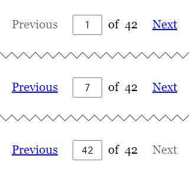

# foliate

Pagination for Ruby on Rails.

**Why another pagination library?**  Because a different approach leads
to a cleaner and much simpler implementation.

**How is it different?**  Instead of extending ActiveRecord, or
defining singleton methods on result sets at runtime, *foliate* adds a
single method to ActionController:

```ruby
## app/controllers/posts_controller.rb
class PostsController < ApplicationController

  def index
    @posts = paginate(Post) # <-- single method
  end

end
```

Calling `paginate` with something like an ActiveRecord::Relation (or an
Array) returns an ActiveRecord::Relation (or an Array) scoped to the
current page of records, as dictated by `params[:page]`.

Calling `paginate` also sets a `@pagination` instance variable for use
in the view.  This object can be passed directly to `render`, which will
then render the "app/views/pagination/_pagination.html.erb" view
partial:

```html
<!-- app/views/posts/index.html.erb -->

Do something with @posts here...

<%= render @pagination %>
```

**What does it look like?**  By default, something like this:




## Appearance

The *foliate* installation generator creates
"app/views/pagination/_pagination.html.erb" and
"app/assets/stylesheets/pagination.scss" in your project directory.
These files can be freely edited to suit your needs.

The installation generator also supports a `--bootstrap` option which
causes the generated stylesheet to apply [Bootstrap 4] classes via Sass
`@extend` directives.  This allows the pagination element to directly
blend in with a Bootstrap-styled site.  For this generated stylesheet to
work, Bootstrap must be loaded into the *same* Sass scope.  For example:

```scss
// in application.scss
@import "bootstrap";
@import "pagination";
```

[Bootstrap 4]: https://getbootstrap.com/


## Records per page

By default, *foliate* allots `Foliate.config.default_per_page` records
per page, which can be configured in "config/initializers/foliate.rb".
However, this can also be overridden on a per-Controller basis using the
`per_page:` argument:

```ruby
@posts = paginate(Post, per_page: 50)
```

## Page param name

*foliate* uses the `:page` query param (i.e. `params[:page]`) to dictate
the current page.  This can be configured by setting
`Foliate.config.page_param` in "config/initializers/foliate.rb".  Doing
so will properly affect both the `paginate` method and the `Pagination`
object.

## Avoiding SQL count on very large tables

To determine the total number of pages, *foliate* performs a SQL count
query.  On very large tables, count queries can have a noticeable
performance cost.  If you have a more performant method of estimating
total record count, you can prevent the count query by specifying the
`total_records:` argument:

```ruby
@posts = paginate(Post, total_records: Post.cached_count)
```

## Full documentation

For more information, see the
[full documentation](http://www.rubydoc.info/gems/foliate/).


## Installation

Add this line to your application's Gemfile:

```ruby
gem "foliate"
```

Then execute:

```bash
$ bundle install
```

And finally, run the installation generator:

```bash
$ rails generate foliate:install
```


## Contributing

Run `rake test` to run the tests.


## License

[MIT License](https://opensource.org/licenses/MIT)
